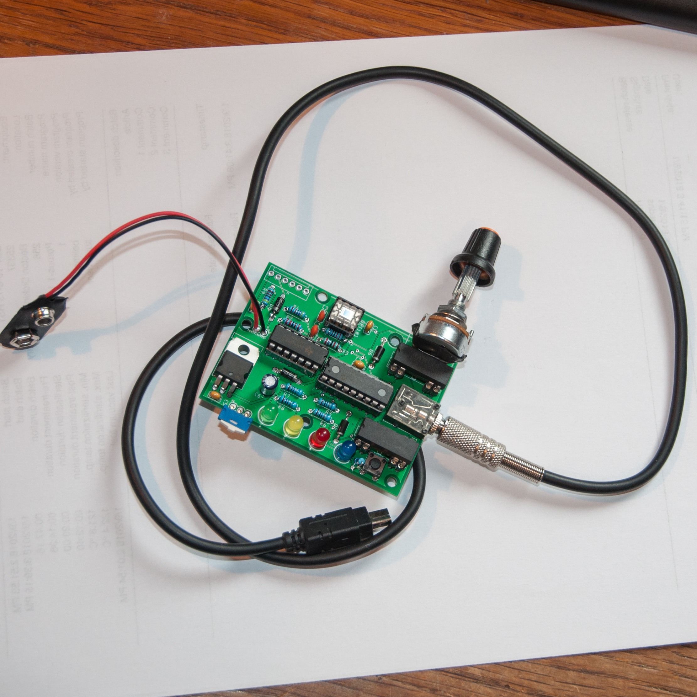
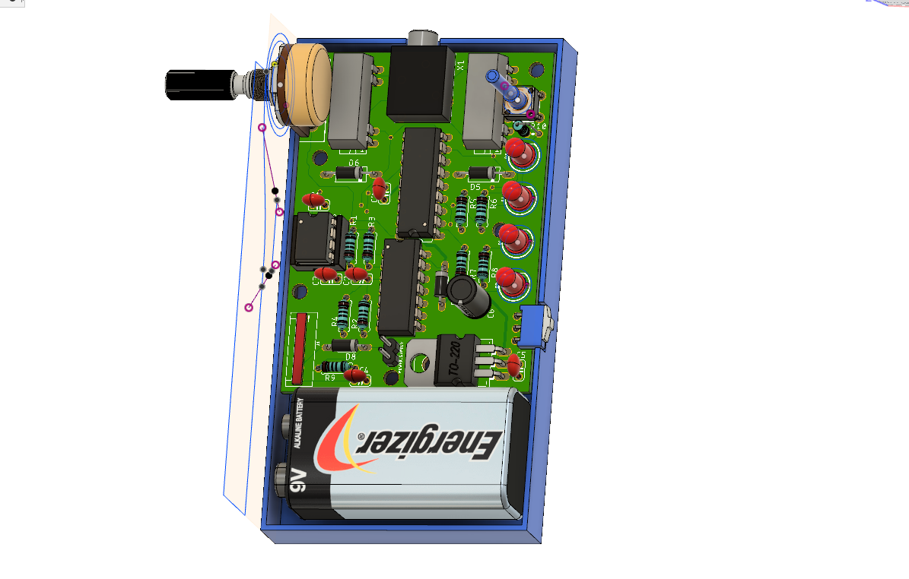
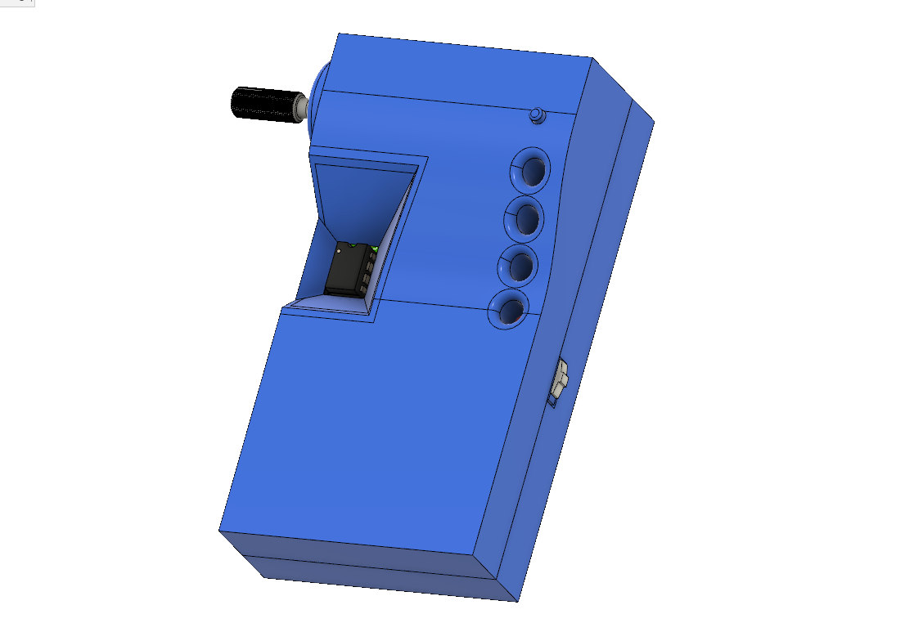

# nikon-lightning-sensing-shutter-remote
This project is an implemenation of the following shutter remote: [http://fototipp.hu/light2](http://fototipp.hu/light2)

## How to deploy:

I've programmed the MCU with the .HEX file separately via pickit3, but I've added programming connector to the schematics. It's your choice how to upload the code. The board design is created by Eagle and the gerber files available too. I've created an enclosure for it but it should be refactored before I publish it because there are some issues to fix.

## How to use:

There are two phases of using this shutter remote. The first one is the setting of the sensitivity. In this mode the red and blue LEDs blink one after another. After the LEDs turn off the second phase is active. In this phase we have to adjust the sensitivity of the sensor with the potentiometer. If the blue LED lights the sensitivity is there is too much light and if the red LED lights then there is too few light. The sweet spot is where the blue LED just lights up so where we are a bit over the edge where the red changes to blue. After this we can start the remote by the pushing the button and the yellow LED lights up. This indicates the focus signal is active and the remainging green LED is for indicating the exposure. To adjoust the sensitivity on the potentiometer clockwise turn decreases and counterclockwise turn will increase the sensitivity

Peolpe in the blog's comment section claimed it works fine. I need more tests to determine wether it works well or not. My indoor tests resulted that it needs quite a bigger impulse to trigger, but probably this was the aim by the creator.

